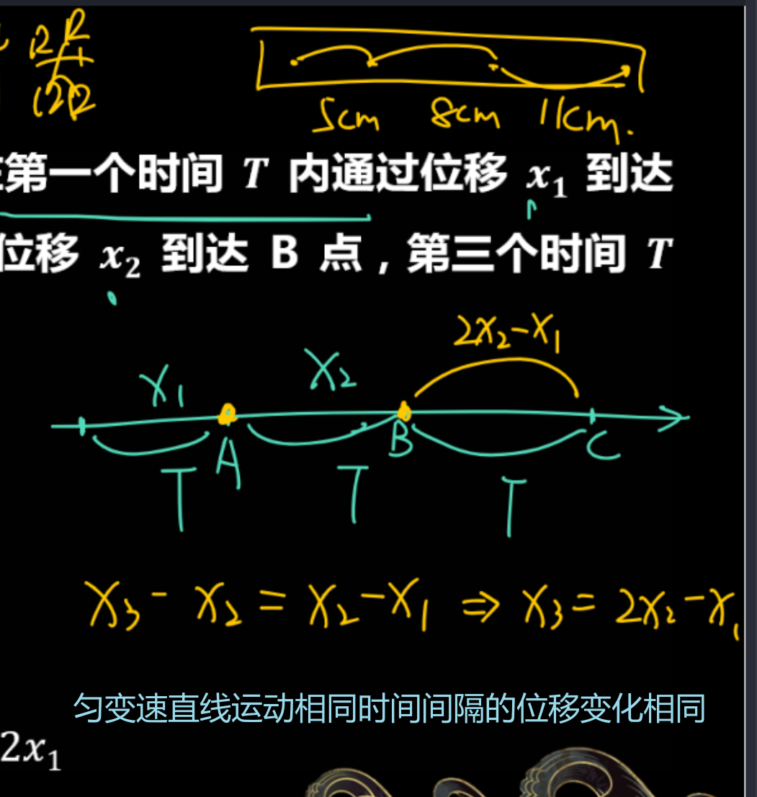

# 第二讲 - 比例问题

数学公式 Latex 识别：[公式识别](https://simpletex.cn/ai/latex_ocr)

## 三个推论

### 1. 比例（等时比、等位比）

通过 v-t 图像利用 **相似三角形** 进行推导，在**初末速度为 0 匀加减速直线运动**中：

可以 **忽略加速度** 的实际大小。

1. 等时比：
	- 每过 T，**速度** 之比： 1:2:3:4
	- 每过 T，**前 T 位** 移比：1:4:9:16
	- 每过 T ，**第 T 内** 位移比: 1:3:5:7

2. 等位比：推导同上见图

### 2. 中时速 = 平均速度

$$
V_{\frac{t}{2}}=\frac{V_{0}+V_{1}}{2}=平均速度
$$

用于 **打点计时器** 计算点的瞬间速度。

**中间时刻**的瞬时速度 = 全程平均速度

### 3. 等时位移差

$$
\Delta x=aT\cdot T=aT^{2}
$$

$$
S_{m^-}S_n=(m-n)\alpha T^2
$$

用于 **打点计时器**

**匀变速** 直线运动 **相同时间间隔的位移变化相同**。

$$
x_{2}-x_{1}=x_{3}-x_{2}=…=x_{n}-x_{n-1}
$$

## 自由落体

**只受重力** G 加速度 g，从**静止**开始。

### 基本公式

$$
\begin{aligned}
&v=gt \\
&h=\frac{1}{2}gt^{2} \\
&v^{2}=2gh
\end{aligned}
$$

### 应用

1. 设时间列位差、中间时刻。
