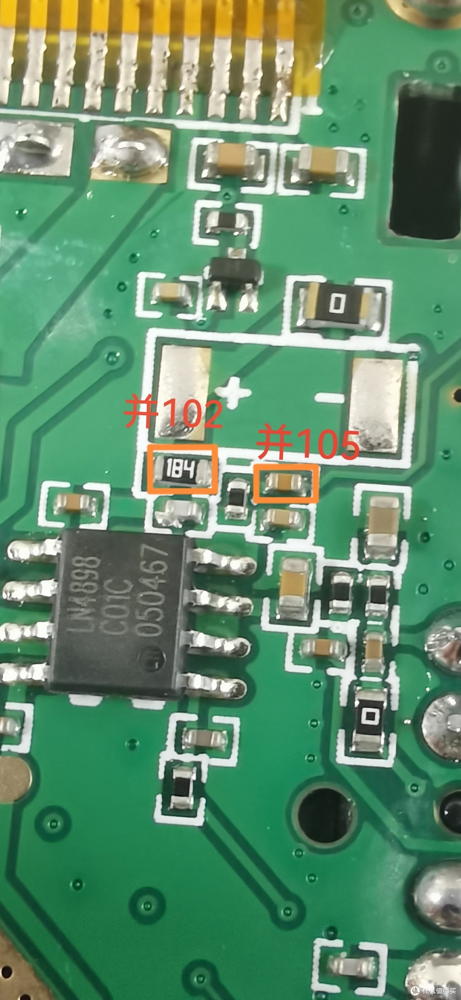

# 泉盛 K5 音质优化

## 资料

一句话经验: 不用换喇叭，把​K​5 的音频功放（LN4890，SOP8 封装）的负反馈电阻，也就是在功放 IC 上部标注“184”的电阻，直接在它上面并联一个 0603 的 1nf 电容，效果就有明显改善。实测音质不输建伍 G71 手台。如果在功放的输入电容上再并联一只 1UF 电容，效果更佳。​

## 方法

在184电阻上并联1nF（102）电容。在他右侧的小电容上并联1uF（105）电容。这个板子上的电容是0402封装的，并联0603电容时两侧多加点锡即可。

