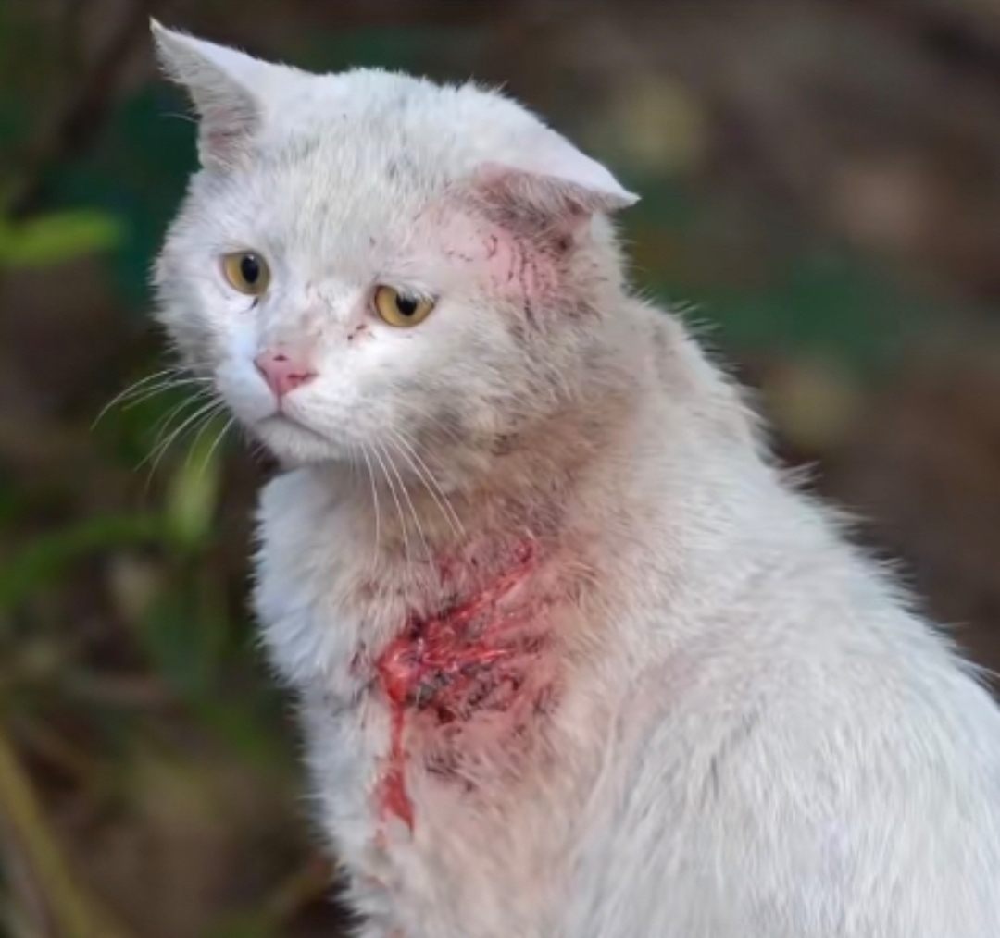

# 文案

<audio controls="controls" src="assets/7235993455749614396-20230523101943-vkl4jzf.mp3" data-src="assets/7235993455749614396-20230523101943-vkl4jzf.mp3"></audio>

<audio controls="controls" src="assets/7235948774571428665-20230523102114-6ckottc.mp3" data-src="assets/7235948774571428665-20230523102114-6ckottc.mp3"></audio>

​​

我希望生活在一个下着永不停歇的大雨的城市，居民大多是习惯孤独的艺术家，很少出门。街道上除了递送员总是空荡荡的，人们上街都穿着有高帽檐的雨衣。而我独自坐在窗前，度过一天又一天。

有时候 有时候  
我会相信一切有尽头  
相聚离开 都有时候  
没有什么会永垂不朽…

抱抱我吧，我快要碎掉了。

回忆 2017 岑宁儿《追光者》2018 买辣椒也用券《起风了》2019 雷雨心《纪念》2020 零一九零贰《忘川彼岸》2021 艾辰《错位时空》2022 陈奕迅《孤勇者》2023 张杰《听》

来去都是自由风，想念自然会重逢。

我深知自己太普通了所以我时常自信 时常自卑 时常在想 什么样的人才会带着真诚来到我身边。

## 抑郁症

我只知道，我在心理诊室听着他们输出他们的观点。他们从不关心我怎么想怎么做，为什么，真的好烧，好烧钱。我舍不得。每次去完之后，父母总是说，“你根本就没问题。800 多块钱一个小时太贵了。你要是不想这么多就好了。这个年纪的小朋友谁没点抑郁啊？”然后，我就开始伪装。我假装自己没有问题一直到现在。可是，我是有病的，只有我自己知道。所以，靠近我的人都会很累。

真的觉得心理医生没有用，只是聊天，而且我说的特别多，也是没有感情的聊天，去心理咨询就跟上课一样，每次都想快点结束，很不耐烦。

‍
